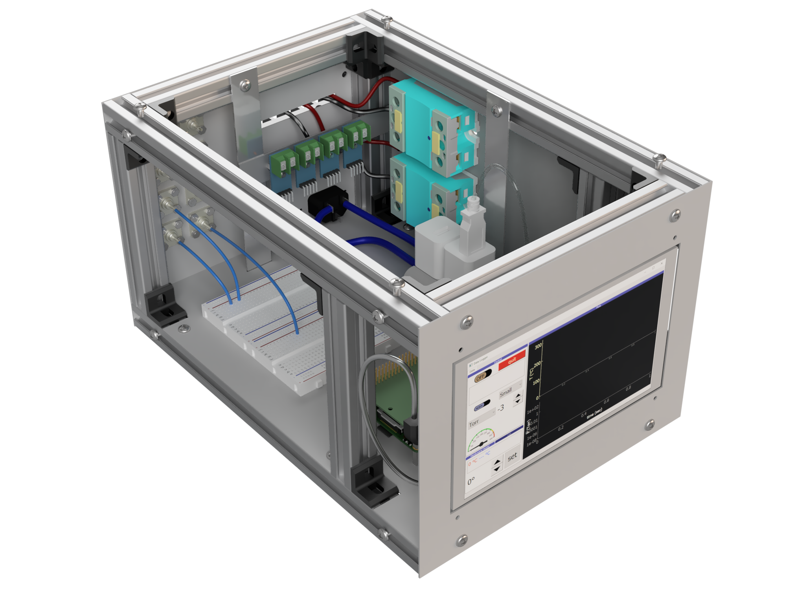
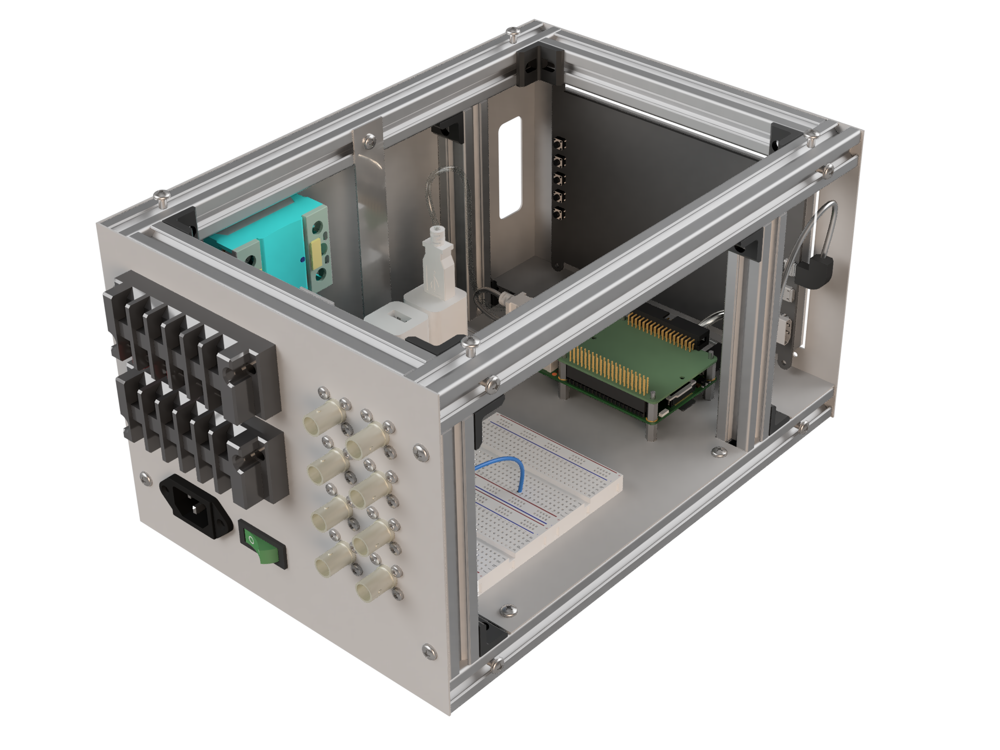
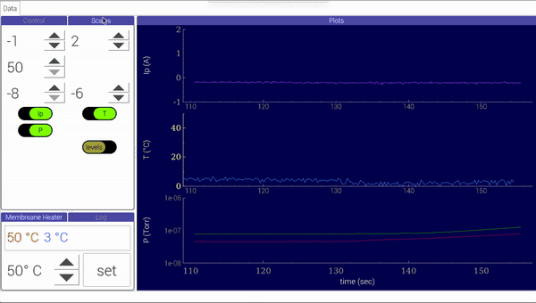

[](https://app.codeship.com/projects/387898)
[](https://github.com/psf/black)

# Control unit for plasma experiment.

# 0. Why bother?

There are commercially available data loggers and temperature control units, however sometimes it is nice to have all things you need in one place, and with a tailored UI. A common practice in many experimental physics labs is to use a Windows machine and [Labview](https://en.wikipedia.org/wiki/LabVIEW) from [National Instruments](https://en.wikipedia.org/wiki/National_Instruments), which work fine and is quite easy to implement for simple set-ups. NI sells all sorts of scientific equipment which is easy to connect to the LabView program.


However, the cheaper and more importantly, open source alternative would be to use  a [SPC](https://en.wikipedia.org/wiki/Single-board_computer). 


# 1. Introduction

This control unit is based on the Raspberry Pi with AD converter and relays. Main purpose of the unit is to control parameters and log signals.


Experimental parameters: 

- temperature
- current
- pressure
- others


In our project, we have an experimental device where we want to measure several signals, plus to implement a feed-back control. 


Control unit box:

| Front view                       | Back view                        |
| -------------------------------- | -------------------------------- |
|  |  |


## 1.1 Hardware components:

- [Raspberry Pi 3 Model B](https://www.raspberrypi.org/products/raspberry-pi-3-model-b/)
- ADC (Analog to Digital Convertor), 16 bit 32 channel: [I2C アナログ入力ボード AIO-32/0RA-IRC](https://www.y2c.co.jp/i2c-r/aio-32-0ra-irc/)
- solid-state relay: Celduc [SO842074](https://docs.rs-online.com/4deb/0900766b8050bf44.pdf)
- halogen lamp as a heating element: Panasonic [JCD100V300WCG](https://www2.panasonic.biz/scvb/a2A/opnItemDetail?use_obligation=scva&contents_view_flg=1&catalog_view_flg=1&item_cd=JCD100V300WCG&item_no=JCD100V300WCG&b_cd=101&hinban_kbn=1&s_hinban_key=JCD100V300WCG&s_end_flg=&vcata_flg=1)
- 7'' touch screen as indicator and input device: [EVICIV B07PY5XND3](https://www.amazon.com/Eviciv-Portable-Monitor-Display-1024X600/dp/B07L6WT77H?ref_=ast_sto_dp&th=1&psc=1)


## 1.2 Program summary

The analog signals from vacuum gauges, 0 - 10 V, and the K-type thermocouple, 0 - 15 mV, are red by the DAC in the worker thread. The Raspi GPIO are used to control the solid state relay and turn on the halogen lamp. A Variac is used to power the lamp.  





# 2. Requirements

```
- pyqtgraph
- numpy
- scipy
- matplotlib
- pandas
- python3-smbus
- RPi.GPIO
```

`pyqtgraph` requires either pyqt5 or pyside. To install pyqt5, use `apt-get`:

```py
sudo apt-get update
sudo apt-get install qt5-default pyqt5-dev pyqt5-dev-tools
```

RPi.GPIO:

```
sudo apt-get update
sudo apt-get install rpi.gpio
```

python3-smbus:

```
python3 -m pip install smbus --user
```

or

```
sudo apt-get install python3-smbus
```


# 3. Usage

## 3.1 start Logger

```
$ pyton3 main.py
```

## 3.2 Settings

### Data folder

The data folder name and location is stored in the settings file, .setings - a csv file. By default the data folder is placed relatively to the parent directory in `../data`.
